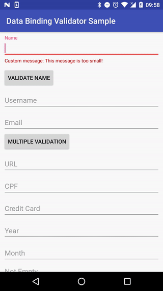

# Data Binding Validator by Ilhasoft

[](https://jitpack.io/#Ilhasoft/data-binding-validator)

The Data Binding Validator makes it easy and quick to validate fields in forms using data binding framework.

## Download

Step 1: Add it in your root build.gradle at the end of repositories:

```
allprojects {
  repositories {
    ...
    maven { url 'https://jitpack.io' }
  }
}
```

Step 2: Add the dependency
```
  dependencies {
    compile 'com.github.Ilhasoft:data-binding-validator:LATEST-VERSION'
  }
```
Latest Version: [](https://jitpack.io/#Ilhasoft/data-binding-validator)


## Features:

* Minimum/Maximum length validation for text fields;
* Validate inputs based on field type (email, credit card, URL, CPF and so on);
* Pre-defined error messages translated into English, Portuguese and Spanish;
* Custom error messages by field;
* Supports [`TextInputLayout`](https://developer.android.com/reference/android/support/design/widget/TextInputLayout.html) and EditText;

## Sample



## Usage

### Enabling Data Binding ###

You need to enable Data Binding to use this library, add the following code into your main module's `build.gradle`:

```
android {
    ....
    dataBinding {
        enabled = true
    }
}
```

### Setting up validations directly on layout ###

It's possible to insert directly on layout creation, the validation on input fields. The error messages in different languages already are configured inside the library, not requiring the adding by developers. These are the existing validation types:

#### Validate Characters Length ####

Adding `validateMinLength` or `validateMaxLength` to your `EditText`, it's possible to configure a minimum or maximum characters length:

```
<EditText
  android:id="@+id/name"
  android:layout_width="match_parent"
  android:layout_height="wrap_content"
  android:hint="Name"
  app:validateMinLength="@{4}"
  app:validateMaxLength="@{10}"/>
```

#### Validate Empty Characters ####

Adding `validateEmpty`, you can validate if the `EditText` is empty:

```
<EditText
  android:id="@+id/hello"
  android:layout_width="match_parent"
  android:layout_height="wrap_content"
  android:hint="Name"
  app:validateEmpty="@{true}" />
```

#### Validate Date Patterns  ####

Adding `validateDate`, you can set a pattern accepted by the `EditText` such as `dd/MM/yyyy`, `yyyy` and so on:

```
<EditText
  android:id="@+id/date"
  android:layout_width="match_parent"
  android:layout_height="wrap_content"
  android:hint="Name"
  app:validateDate='@{"dd/MM/yyyy"}' />
```

#### Validate Regex  ####

Adding `validateRegex`, you can set a regular expression to be validated, for example:

```
<EditText
  android:id="@+id/regex"
  android:layout_width="match_parent"
  android:layout_height="wrap_content"
  android:hint="Name"
  app:validateRegex='@{"[a-zA-Z0-9-._]+"}'
  app:validateRegexMessage="@{@string/regexErrorMessage}" />
```

#### Validate Input Types ####

You can even validate input by date, for example Email, URL, Username, CreditCard, CPF, CEP and so on:

```
<EditText app:validateType='@{"email"}' />

<EditText app:validateType='@{"url"}' />

<EditText app:validateType='@{"creditCard"}' />

<EditText app:validateType='@{"username"}' />

<EditText app:validateType='@{"cpf"}' />
```

### Applying Validation ###

It will be necessary to instantiate `Validator` passing as argument your `ViewDataBinding` instance got from your layout binding. After that you can call `validate()` that will return if your data is valid or not. Example:

```
@Override
protected void onCreate(Bundle savedInstanceState) {
  super.onCreate(savedInstanceState);

  MainActivityBinding binding = DataBindingUtil.setContentView(this, R.layout.main_activity);
  final Validator validator = new Validator(binding);

  binding.validate.setOnClickListener(new View.OnClickListener() {
    @Override
    public void onClick(View v) {
      if (validator.validate()) {
        saveToDatabase();
      }
    }
  });
}
```

Or you can use `toValidate()` if prefer using listener to validation response:

```
public class YourActivity extends AppCompatActivity implements Validator.ValidationListener {

    ...

    @Override
    protected void onCreate(Bundle savedInstanceState) {
        super.onCreate(savedInstanceState);

        MainActivityBinding binding = DataBindingUtil.setContentView(this, R.layout.main_activity);
        final Validator validator = new Validator(binding);
        validator.setValidationListener(this);

        binding.validate.setOnClickListener(new View.OnClickListener() {
            @Override
            public void onClick(View v) {
                validator.toValidate()
            }
        });
    }

    @Override
    public void onValidationSuccess() {
        saveToDatabase();
    }

    @Override
    public void onValidationError() {
        Toast.makeText(YourActivity.this, "Dados inválidos!", Toast.LENGTH_SHORT).show();
    }
}
```

### Custom Error Messages ###

You can add custom error messages by using the same validation rule name and adding `Message` at the end, such as `validateTypeMessage`, `validateDateMessage`, `validateRegexMessage` and so on. For example:

```
<EditText
  android:id="@+id/date"
  android:layout_width="match_parent"
  android:layout_height="wrap_content"
  android:hint="Name"
  app:validateDate='@{"dd/MM/yyyy"}'
  app:validateDateMessage="@{@string/dateErrorMessage}" />
```

### Validating ###

If you want to validate all the fields, you can simply call `validator.validate()`, to validate specific views you can call `validator.validate(view)` or `validator.validate(viewsList)`;

### Validation modes ###

The validation can be applied in two way, field by field or the whole form at once. By default, it's configured field by field, however, you can call `validator.enableFormValidationMode();` to enable the validation of the whole form.

If you want to come back to the default way, call `validator.enableFieldValidationMode();`

### Auto dismiss ###

By default, the library prompts error messages and doens't dismiss the error automatically, however, you can add on your layout validation the same rule name by adding `AutoDismiss` at the end, which receives a `boolean`. In this case it could dismiss the error automatically. For example:

```
<EditText
  android:id="@+id/date"
  android:layout_width="match_parent"
  android:layout_height="wrap_content"
  android:hint="Name"
  app:validateDate='@{"dd/MM/yyyy"}'
  app:validateDateMessage="@{@string/dateErrorMessage}"
  app:validateDateAutoDismiss="@{true}" />
```

## License ##

    Copyright 2017-present Ilhasoft

    Licensed under the Apache License, Version 2.0 (the "License");
    you may not use this file except in compliance with the License.
    You may obtain a copy of the License at
    
       http://www.apache.org/licenses/LICENSE-2.0
    
    Unless required by applicable law or agreed to in writing, software
    distributed under the License is distributed on an "AS IS" BASIS,
    WITHOUT WARRANTIES OR CONDITIONS OF ANY KIND, either express or implied.
    See the License for the specific language governing permissions and
    limitations under the License.
